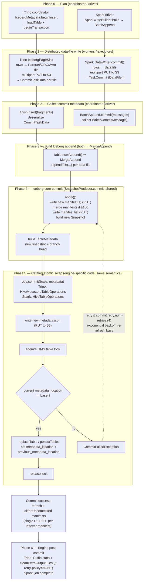
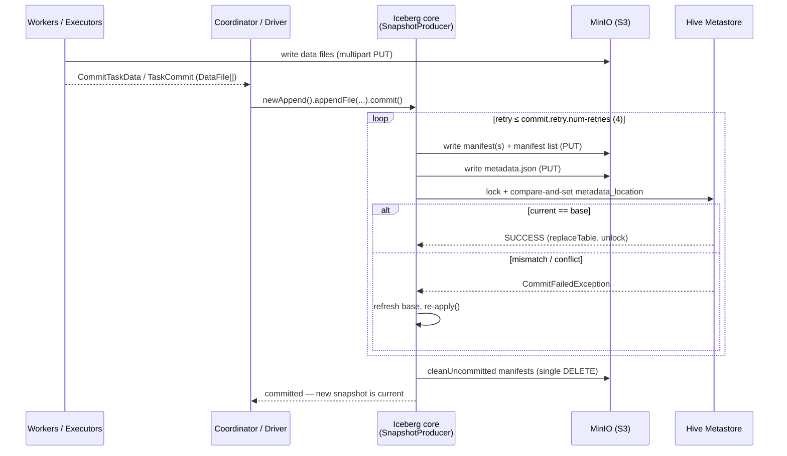

## Overview

This topic documents the end-to-end workflow Iceberg follows for the scenario **"insert data and
commit"**, illustrated with concrete `INSERT` examples from **Trino 467** and **Spark 3.5.1**, both
on a Hive-metastore catalog with S3/MinIO storage. It is the constructive ("what happens on the
happy path") companion to the prior S3-delete root-cause reports.

**Key structural fact:** both engines do their own *distributed data-file write* and *commit-task
collection*, then **converge on the same Iceberg core commit** (`AppendFiles`/`MergeAppend` →
`SnapshotProducer.commit()` from the bundled `iceberg-core`). They differ only in the final
*catalog atomic-swap* implementation — Trino uses its own `HiveMetastoreTableOperations`, Spark uses
Iceberg's `HiveTableOperations` — but both perform the **same** operation: write a new
`metadata.json`, take a Hive lock, compare-and-set the table's `metadata_location`, then `replaceTable`
and unlock.

```text
Trino:  INSERT INTO iceberg.tpch.customer SELECT * FROM tpch.sf1.customer;
Spark:  INSERT INTO hive_prod.db.customer SELECT * FROM source;
        -- or: df.writeTo("hive_prod.db.customer").append();
```

## Workflow diagram (end-to-end)



## Commit sequence (Phase 4–5 detail)



## Detailed step descriptions

### Phase 0 — Plan
- **Trino**: `IcebergMetadata.beginInsert` loads the table and opens an Iceberg transaction
  (`plugin/trino-iceberg/.../IcebergMetadata.java:1191`). It builds an `IcebergWritableTableHandle`
  carrying the table, schema, partition spec, and the `RetryMode`.
- **Spark**: `SparkWriteBuilder.build()` produces a `SparkWrite`; for an append it selects the
  `BatchAppend` batch-write (`spark/v3.5/.../source/SparkWrite.java:294`).

### Phase 1 — Distributed data-file write (workers / executors)
Each parallel task converts input rows to Iceberg data files (Parquet/ORC/Avro) and streams the
bytes to S3 via multipart upload (`CreateMultipartUpload` → `UploadPart`… → `CompleteMultipartUpload`,
or a single `PutObject` for small files). The data files are **not yet referenced** by the table.
- **Trino**: `IcebergPageSink` writes pages; file paths are `{location}/data/{queryId}-{uuid}.{fmt}`
  (`IcebergPageSink.java:350`). `finish()` returns one `CommitTaskData` per file
  (`IcebergPageSink.java:227`). If a task fails here, `abort()` deletes that task's files (see the
  delete reports).
- **Spark**: `UnpartitionedDataWriter` / `PartitionedDataWriter` write rows; `commit()` returns a
  `TaskCommit` wrapping the produced `DataFile[]` (`SparkWrite.java:765, 822`). `abort()` deletes the
  task's files on failure (`:775, 832`).

### Phase 2 — Collect commit metadata on the coordinator / driver
- **Trino**: `finishInsert(session, handle, fragments, …)` deserializes the `CommitTaskData`
  fragments returned by all sinks (`IcebergMetadata.java:1257`).
- **Spark**: the driver gathers all executors' `WriterCommitMessage[]` and calls
  `BatchAppend.commit(messages)` (`SparkWrite.java:296`), extracting the `DataFile`s via `files(...)`.

### Phase 3 — Build the Iceberg append (both → MergeAppend)
Both engines create an `AppendFiles` and add every committed data file:
- **Trino**: `transaction.newAppend()` (because `merge_manifests_on_write=true` by default) then
  `appendFiles.appendFile(...)` per task (`IcebergMetadata.java:1282, 1298`).
- **Spark**: `table.newAppend()` then `append.appendFile(file)` per `DataFile`
  (`SparkWrite.java:297, 302`).
- `newAppend()` returns Iceberg's **`MergeAppend`** in both (`core/.../BaseTable.java:191`).

### Phase 4 — Iceberg core commit (shared `SnapshotProducer.commit()`)
This is the bundled `iceberg-core` and is identical for both engines.
1. **`apply()`** (`core/.../SnapshotProducer.java:272`): writes new manifest file(s) for the appended
   data files; if a partition-spec manifest group has ≥100 manifests
   (`commit.manifest.min-count-to-merge`, default 100), small manifests are merged; writes the
   **manifest list** (`manifestListPath()`, `:283/590`); builds a new `BaseSnapshot` (`:336`). All
   of these are new S3 objects (PUT).
2. **Build `TableMetadata`** with the new snapshot set as the branch head (`:477-487`).
3. **`taskOps.commit(base, updated)`** — hand off to the catalog (Phase 5).
4. The whole block runs under a **retry loop**: `Tasks.foreach(ops).retry(COMMIT_NUM_RETRIES=4)
   .exponentialBackoff(...).onlyRetryOn(CommitFailedException.class)` (`:464-471`). A conflicting
   commit triggers a refresh + re-`apply()` and another attempt.

### Phase 5 — Catalog atomic swap (engine-specific code, same semantics)
The actual `TableOperations.commit(base, metadata)` differs by engine but does the same four things:
write metadata → lock → compare-and-set → persist+unlock. This is what makes the commit **atomic and
serializable** under concurrent writers.

- **Trino** — `AbstractIcebergTableOperations.commit` does a stale check
  (`AbstractIcebergTableOperations.java:145, 151`) then `commitToExistingTable`
  (`HiveMetastoreTableOperations.java:65`): `writeNewMetadata` (new `metadata.json` PUT),
  `acquireTableExclusiveLock` on HMS (`:87`), verify the table's current `metadata_location` equals
  the base's (optimistic concurrency; mismatch → `CommitFailedException`, `:98-100`),
  `metastore.replaceTable(...)` setting `metadata_location` + `previous_metadata_location`
  (`:80, 108`), then `releaseTableLock` (`:118`).
- **Spark / Iceberg** — `HiveTableOperations.doCommit`
  (`hive-metastore/.../HiveTableOperations.java:241`): `writeNewMetadataIfRequired` (`:261`),
  `lock.lock()` (`:270-272`), CAS on `metadata_location` (mismatch → `CommitFailedException`, `:307`),
  `persistTable(...)` (`:348`), and `cleanupMetadataAndUnlock` in a `finally` (`:426`) which deletes
  the new `metadata.json` only if the commit FAILED, then unlocks.

On `CommitFailedException` the core retries (Phase 4.4). On `CommitStateUnknownException` (the persist
may have landed) it rethrows **without** cleanup, deliberately leaving files in place.

### Phase 6 — Post-commit
- **Core**: after a verified success, `SnapshotProducer` refreshes and runs `cleanUncommitted` to
  delete manifests written by attempts that did not end up in the committed snapshot, plus unused
  manifest lists from extra attempts — **single** `deleteFile` calls
  (`SnapshotProducer.java:521-532`).
- **Trino**: `commitTransaction` finalizes; a Puffin statistics file may be written
  (`IcebergMetadata.java:1316`); `cleanExtraOutputFiles` runs **only if `retry-policy != NONE`**
  (`:1303`), listing the output dir and bulk-deleting non-committed staging files.
- **Spark**: the write job completes; no further per-statement work.

## What exists in S3 after a successful first INSERT

```
{table}/data/{queryId|partition}-{uuid}.parquet     ← data files (Phase 1)
{table}/metadata/{snap-id}-{uuid}.avro              ← manifest file(s) (Phase 4)
{table}/metadata/snap-{snap-id}-{uuid}.avro         ← manifest list (Phase 4)
{table}/metadata/{version}-{uuid}.metadata.json     ← new table metadata (Phase 5)
```
The Hive Metastore's table `metadata_location` parameter now points at the new `metadata.json`; the
previous value is preserved in `previous_metadata_location`.

## Notes and caveats
- **Atomicity** comes entirely from the Phase-5 compare-and-set on `metadata_location` under the HMS
  lock; data/manifests written in Phases 1 and 4 are invisible until that swap succeeds. A crash
  before the swap leaves orphan data/manifest files (cleaned later by `remove_orphan_files`), never a
  partially-visible table.
- **MergeAppend vs FastAppend**: both engines default to `MergeAppend`. Set
  `merge_manifests_on_write=false` (Trino session / table prop) to use `FastAppend`, which never
  merges and so writes one manifest per commit with no merge-cleanup deletes.
- Delete-side behavior of this same workflow (when and why S3 DELETE / bulk `DeleteObjects` happen) is
  covered in the companion reports below.

## References
- Trino: `IcebergMetadata.java:1191, 1257, 1282, 1298, 1303, 1316`;
  `IcebergPageSink.java:227, 350, 765`;
  `AbstractIcebergTableOperations.java:145, 226`; `HiveMetastoreTableOperations.java:65, 87, 98, 108, 118`
  (`references/trino` @ 467)
- Spark/Iceberg: `SparkWrite.java:294, 296, 297, 302, 765, 822`;
  `core/.../SnapshotProducer.java:272, 459, 521`; `core/.../BaseTable.java:191`;
  `hive-metastore/.../HiveTableOperations.java:241, 261, 270, 307, 348, 426`
  (`references/iceberg` @ apache-iceberg-1.11.0, `references/spark` @ v3.5.1)
- Companion: [Trino INSERT S3-delete](20260608-trino-iceberg-insert-s3-delete-conditions.report.md) ·
  [Spark INSERT/MERGE S3-delete](20260608-spark-iceberg-insert-merge-s3-delete-conditions.report.md) ·
  [Cross-engine bulk-delete root causes](20260608-iceberg-s3-bulk-delete-cross-engine-root-causes.report.md)
