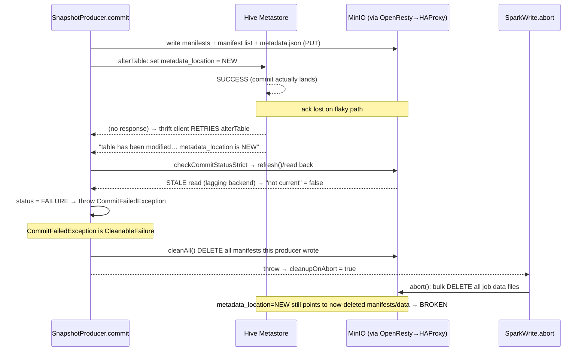

## Overview

The earlier reports concluded the bulk `DeleteObjects` traffic was *cleanup of files written by
write attempts that never committed* — which, on a correct object store, is **safe**: it only ever
removes orphans, never live data. Yet the table is now **broken** (queries fail with missing
data/manifest files). This report resolves that apparent contradiction by tracing, in source, the
exact path by which the cleanup logic can delete a **live, committed** file — and identifies the top
root cause.

**Verdict: The corruption is a *false-negative commit classification* defeating Iceberg's
delete-safety guard. Iceberg only deletes written files when a commit is judged to have *failed*
(`CommitFailedException`/`ValidationException`, which implement `CleanableFailure`); it deliberately
does **not** delete when the outcome is *ambiguous* (`CommitStateUnknownException`). That judgement is
made by `checkCommitStatus`, which decides FAILURE-vs-UNKNOWN by **reading the object store back** to
see whether the new metadata is live. The OpenResty→HAProxy→MinIO-cluster path does not present a
single strongly-consistent, idempotent S3 endpoint: a commit can actually succeed while its
acknowledgement is lost (triggering an HMS-client retry and a "table has been modified" error), and
the subsequent status read can return stale data and wrongly conclude FAILURE. That false FAILURE is
a `CleanableFailure`, so `SnapshotProducer.cleanAll()` deletes the manifests — and Spark's
`abort()` bulk-deletes the data files — that the now-committed snapshot references. The Hive
Metastore's `metadata_location` points at a valid `metadata.json` whose manifests/data have been
deleted → the table is broken. The root cause is the non-consistent / non-idempotent storage path
combined with auto-cleanup; speculation / fault-tolerant execution and SDK/HMS retries are
amplifiers.**

## The paradox, and its resolution

"Cleanup only deletes non-committed orphans" is true **only when the engine correctly knows a commit
failed.** Iceberg's safety model is explicitly three-valued:

| Commit outcome | Exception thrown | `CleanableFailure`? | Cleanup (delete) runs? |
|---|---|---|---|
| Definitely failed | `CommitFailedException` | **Yes** (`CommitFailedException.java:24`) | **Yes** — files are true orphans, safe |
| Validation/conflict | `ValidationException` | **Yes** (`ValidationException.java:35`) | **Yes** — safe |
| Ambiguous / unknown | `CommitStateUnknownException` | **No** (`CommitStateUnknownException.java:25`) | **No** — files left in place, safe |

The model is correct **iff** an ambiguous outcome is never mislabeled as a definite failure. The
corruption is precisely that mislabeling: a commit that **succeeded** is reported as
`CommitFailedException`. Then deleting "orphans" deletes live files.

## Where the (mis)classification is decided

`checkCommitStatusStrict` (`core/.../BaseMetastoreOperations.java:99-151`) loops, calling a
`commitStatusSupplier` that **reads back** whether the new metadata location is now current/in
history (`refresh()` → `checkCurrentMetadataLocation`, `BaseMetastoreTableOperations.java:334-336`):

- supplier returns **true** → `SUCCESS` (`:132-137`);
- supplier returns **false** (read succeeded but new metadata not found) → **`FAILURE`** (`:138-139`);
- supplier **throws** repeatedly (cannot read) → stays `UNKNOWN` (`:119, 143-150`).

`checkCommitStatus` (non-strict) softens FAILURE→UNKNOWN (`:71-78`) — the safe default. But the
**strict** variant, which can return FAILURE, is invoked on one specific signal: the HMS error
"The table has been modified. The parameter value for key 'metadata_location' is …"
(`hive-metastore/.../HiveTableOperations.java:381-395`). Its own comment (`:387-390`) admits the
trigger: *"It's possible the HMS client incorrectly retries a successful operation, due to network
issue for example, and triggers this exception."* On a flaky path that retry is common — and if the
status read is stale, strict returns FAILURE → `throw new CommitFailedException` (`:393`).

## Corruption mechanism — Spark 3.5.1 + Iceberg 1.11.0 (primary)

Code path:
1. `SnapshotProducer.commit()` retry block runs `taskOps.commit(base, updated)` which **succeeds** at
   HMS (`core/.../SnapshotProducer.java:464-502`).
2. Lost ack → HMS client retry → "table has been modified" → `checkCommitStatusStrict` →
   stale read → FAILURE → `CommitFailedException` (`HiveTableOperations.java:391-394`).
3. Back in `SnapshotProducer.commit()`, the outer catch:
   `if (!strictCleanup || e instanceof CleanableFailure) { Exceptions.suppressAndThrow(e, this::cleanAll); }`
   (`SnapshotProducer.java:506-512`). `CommitFailedException` is `CleanableFailure` → **`cleanAll()`
   deletes every manifest + manifest list this producer wrote** (`:578-583`), including those the
   committed snapshot now references.
4. The exception propagates to `SparkWrite.commitOperation` → `cleanupOnAbort = e instanceof
   CleanableFailure` = true (`SparkWrite.java:241`); the DSv2 framework calls `BatchWrite.abort` →
   `SparkWrite.abort` → `SparkCleanupUtil.deleteFiles("job abort", …)` → **bulk-deletes all data
   files the job wrote** (`SparkWrite.java:246-252`).
5. HMS `metadata_location` = the NEW `metadata.json`, which references the just-deleted manifest
   list / manifests / data files. **Reads fail with NotFound → table broken.**

## Corruption mechanism — Trino 467 (secondary; catalog layer is hardened)

Trino's catalog commit is **more defensive**: on any `replaceTable` exception it throws
`CommitStateUnknownException` (not a `CleanableFailure`), so the core skips cleanup
(`HiveMetastoreTableOperations.java:110-113`). Its lock-release comment even states the intent:
*"after commit has already succeeded … iceberg API will not do the metadata cleanup, otherwise table
will be in unusable state"* (`:121-122`). So Trino is largely protected against the Spark-style
metadata-pointer corruption.

Trino's exposure is the **connector-side directory cleanup** under fault-tolerant execution:
- `cleanExtraOutputFiles` runs in `finishInsert` when `retry-policy != NONE`
  (`IcebergMetadata.java:1303-1305`); it **lists** the data directory and **bulk-deletes** files named
  `{queryId}-…` that are not in the to-be-committed keep set (`:1346-1405`). On an inconsistent
  `listFiles` / partial task-result set, a file that *should* be kept can be judged an orphan and
  deleted. Also, a genuine pre-write conflict throws `CommitFailedException` (`:99-100` of
  `HiveMetastoreTableOperations`) → core `cleanAll` of the pre-commit manifests (safe only because
  Trino has not yet swapped the pointer on that attempt).

Trino tables can also *appear* broken without any wrong delete, if the storage path returns 404 for
objects that exist (HAProxy routing reads to a backend lacking the object) — see Root Cause 1.

## Top root causes (ranked)

### 1. Storage path is not a single consistent/idempotent S3 endpoint — THE root cause
**Confidence: MEDIUM–HIGH.** Iceberg's commit + recovery protocol assumes strong read-after-write
consistency and idempotent requests. OpenResty→HAProxy→MinIO-**cluster** breaks this if MinIO behind
HAProxy is multiple independent pools/clusters (no cross-backend consistency), or if the proxy retries
non-idempotent requests / alters conditional headers / buffers bodies. This single fact produces both
(a) lost/ambiguous commit acks and HMS-client retries, and (b) stale status-check reads — which
together convert the safe UNKNOWN path into a dangerous false FAILURE, driving cleanup to delete live
files. It is also the only variable shared by both engines, matching the cross-engine symptom.

### 2. Auto-cleanup on `CleanableFailure` deletes live files when classification is wrong
**Confidence: HIGH (mechanism, source-cited).** `SnapshotProducer.cleanAll` + `SparkWrite.abort`
delete on `CommitFailedException`/`ValidationException`. Correct on a true failure; catastrophic on a
false failure (Root Cause 1). This is the deletion engine that does the damage.

### 3. Retry/idempotency gaps: HMS thrift-client retry + S3 SDK retry + proxy retry
**Confidence: MEDIUM.** A successful-but-unacked `alterTable` retried by the HMS client is the exact
trigger for the strict status check (`HiveTableOperations.java:387-390`). SDK/proxy retries of
DELETE/PUT compound the timing windows.

### 4. Fault-tolerant execution / speculative execution arm the cleanup paths
**Confidence: MEDIUM.** Trino `retry-policy=TASK` makes `cleanExtraOutputFiles` run on every insert;
Spark speculation/task retries create the abort paths. With these off, fewer cleanup invocations and
fewer windows for Root Causes 1–2 to corrupt.

### 5. Stale `refresh()` building on an old base (lost-update)
**Confidence: LOW–MEDIUM.** Under inconsistency, a commit retry's `refresh()` may read stale metadata
and a later attempt could clobber a concurrent commit. Distinct from deletion but another
consistency-driven corruption to keep in mind.

## Why it "seemed impossible"
On a correct S3 (single strongly-consistent, idempotent endpoint — real AWS S3, or one consistent
MinIO cluster), ambiguous commits resolve to `CommitStateUnknownException` and the status check reads
the truth, so cleanup never touches live files. The corruption is unreachable there. It becomes
reachable **only** once the storage path stops being consistent/idempotent — exactly what an
OpenResty + HAProxy + multi-node MinIO front can introduce. The designers anticipated the failure mode
(see the Trino comment at `HiveMetastoreTableOperations.java:121-122`); the Spark/Iceberg strict path
is the gap that the flaky store turns into data loss.

## Diagnostics (confirm the mechanism)

1. **Identify the missing objects.** From the table's current `metadata.json` (HMS
   `metadata_location`), walk manifest-list → manifests → data files and `HEAD` each on MinIO. Broken
   table = current snapshot references objects that 404. Note whether the missing ones are
   **manifests** (points to Spark `cleanAll`) or **data files** (Spark `abort` / Trino
   `cleanExtraOutputFiles`).
2. **Cross-check MinIO access logs** for `DELETE`/`POST ?delete` on those exact keys, and find the
   commit window just before. Look for a preceding HMS `alter_table` retry / 5xx / timeout on the same
   table around that time.
3. **Test storage consistency/idempotency directly:** PUT an object via OpenResty, then immediately
   GET/LIST it many times through HAProxy; confirm every backend returns it (no 404), and confirm the
   proxy does not retry POST/DELETE. Verify MinIO behind HAProxy is **one** distributed cluster, not
   independent pools.
4. **Reproduce safely:** on a scratch table, inject latency/5xx on the metadata path during commit and
   watch for `CommitFailedException` + subsequent deletes of committed files.

## Remediation

- **Fix the storage path first (Root Cause 1).** Present MinIO as a single strongly-consistent S3
  endpoint: one distributed/erasure-coded cluster, or HAProxy routing that preserves read-after-write
  (sticky/consistent backend, or a properly replicated setup). Ensure OpenResty/HAProxy do **not**
  retry non-idempotent S3 requests and do not alter `Content-MD5`/conditional headers or buffer bodies
  in ways that corrupt PUT/`POST ?delete`. Align HAProxy `timeout server/client` with large
  PUT/multipart-complete and metadata operations.
- **Reduce cleanup exposure while you fix the store:** Spark `spark.speculation=false` and conservative
  `spark.task.maxFailures`; Trino `retry-policy=NONE` (disables `cleanExtraOutputFiles`). This shrinks
  the windows for false-failure deletion.
- **Recovery for an already-broken table:** roll the table back to a healthy snapshot
  (`rollback_to_snapshot` / set `current-snapshot-id`, or restore a prior `metadata.json` via
  `register_table`/metastore `metadata_location`) that predates the bad commit; the deleted objects in
  the bad snapshot are unrecoverable, so the last good snapshot is the restore point. Then
  re-run the affected writes after the storage path is fixed.
- **Harden commits:** keep HMS client retries idempotent / disabled for `alter_table` where possible;
  prefer a catalog/lock implementation that returns `CommitStateUnknownException` (not Cleanable) on
  ambiguous acks — Trino already does this; for Spark/Iceberg ensure the metastore + store make the
  strict-check reliable so it never false-FAILUREs.

## Evidence Quality

| Claim | Source | Tier | Confidence |
|---|---|---|---|
| `CommitFailedException`/`ValidationException` are `CleanableFailure`; `CommitStateUnknownException` is not | `api/.../exceptions/*.java:24/35/25` | official | HIGH |
| `cleanAll()` deletes producer manifests on CleanableFailure | `core/.../SnapshotProducer.java:506-512, 578-583` | official | HIGH |
| `checkCommitStatusStrict` returns FAILURE on a stale/"not found" read | `core/.../BaseMetastoreOperations.java:99-151` | official | HIGH |
| Strict path triggered by HMS "table has been modified" + retry comment | `hive-metastore/.../HiveTableOperations.java:381-395` | official | HIGH |
| Spark `abort` bulk-deletes job files when `cleanupOnAbort` (CleanableFailure) | `spark/v3.5/.../SparkWrite.java:241-252` | official | HIGH |
| Trino converts replaceTable ambiguity to `CommitStateUnknownException` (hardened) | `HiveMetastoreTableOperations.java:110-122` | official | HIGH |
| Trino `cleanExtraOutputFiles` list+bulk-delete under retry-policy≠NONE | `IcebergMetadata.java:1303-1405` | official | HIGH |
| Storage path inconsistency is the trigger in this environment | inference from architecture + symptom | — | MEDIUM (verify via Diagnostics) |

**Gaps:** the deletion *mechanism* is fully source-cited (HIGH); attributing the trigger to your
specific OpenResty/HAProxy/MinIO consistency behavior is inference until confirmed by the Diagnostics
(MinIO single-cluster check, proxy retry/header behavior, and log correlation on the broken keys).

## References
- Iceberg: `api/.../exceptions/{CommitFailedException,ValidationException,CommitStateUnknownException,CleanableFailure}.java`;
  `core/.../SnapshotProducer.java:464-583`; `core/.../BaseMetastoreOperations.java:63-151`;
  `core/.../BaseMetastoreTableOperations.java:298-336`; `hive-metastore/.../HiveTableOperations.java:241-427`
  (`references/iceberg` @ apache-iceberg-1.11.0)
- Spark: `spark/v3.5/.../source/SparkWrite.java:235-265`; `SparkPositionDeltaWrite.java:298-347`
  (Iceberg 1.11.0 / `references/spark` @ v3.5.1)
- Trino: `IcebergMetadata.java:1303-1405`;
  `catalog/hms/HiveMetastoreTableOperations.java:65-127`;
  `catalog/AbstractIcebergTableOperations.java:145-186` (`references/trino` @ 467)
- Extends: [cross-engine bulk-delete root causes](20260608-iceberg-s3-bulk-delete-cross-engine-root-causes.report.md),
  [INSERT+commit workflow](20260608-iceberg-insert-commit-workflow.report.md),
  [Trino delete report](20260608-trino-iceberg-insert-s3-delete-conditions.report.md),
  [Spark delete report](20260608-spark-iceberg-insert-merge-s3-delete-conditions.report.md)
