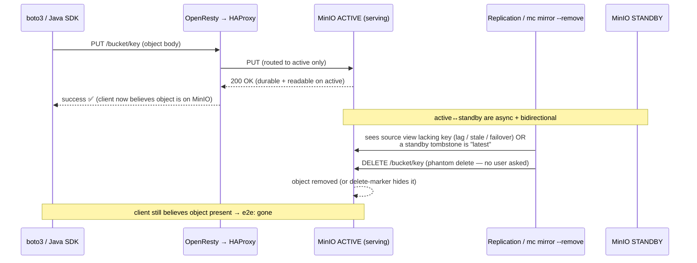

## Overview

This is the same destructive event as the Iceberg corruption report — a *live, acknowledged* object
is deleted by the storage path — but stripped of Iceberg, Spark, Trino, and the Hive Metastore. A
single S3 client uploads one object, the SDK reports success, no application ever issues a delete, and
yet the object disappears and the stack logs a `DELETE`. Removing the engines removes every
"cleanup-on-failure" code path the prior report blamed. So this case answers a sharper question: **can
the OpenResty→HAProxy→active/standby-MinIO path delete a successfully-written object entirely on its
own?** It can — and identifying *which* component issues the phantom `DELETE` is the whole problem.

**Verdict: the deleter is the bidirectional replication/sync plane between the two clusters, not the
client. The client genuinely wrote to active (HAProxy routes client traffic there, and a single MinIO
cluster is strongly read-after-write consistent — [MinIO distributed
docs](../resources/minio/distributed-consistency.summary.md)), so the success is real and the object
truly existed. The `DELETE` arrives *out of band* from the active↔standby link, because two-way
replication and destination-pruning sync are delete-propagating engines: (1) a `mc mirror --remove`
sync makes the destination match a stale/lagging source by issuing real `DeleteObject` calls for keys
the source "doesn't have yet"; (2) native two-way bucket replication with delete/delete-marker
replication propagates a *tombstone that exists on the standby* (from a prior incarnation of the key,
an ILM expiry, or a failover-era delete) back onto the freshly-written object on active; (3)
failover/failback divergence resolves a split-brain by deleting the "extra" copy. "No other client"
is the trap: from the active cluster's view the standby peer, the mirror job, ILM, and healing are all
writers/deleters — HAProxy-routed client traffic is only one mutation source. This is Root Cause #1 of
the corruption report ("the path is not a single consistent/idempotent S3 endpoint") in isolation,
proving the engines were never required for data loss.**

## The puzzle: why it looks impossible

The end-to-end facts seem mutually exclusive:

1. **The upload truly succeeded.** HAProxy sends client traffic to the active cluster only, and a
   single MinIO deployment is strongly read-after-write consistent within itself. So the `PutObject`
   200 is honest: the object was durably stored on active and was readable there. This is *not* a
   false-positive ack and *not* the read-after-write-across-replicas problem of the prior report
   (which is about **reads** routed to an unsynced backend). Here the client always reads/writes the
   same consistent active cluster.
2. **The client never deletes.** boto3 `put_object` is an idempotent single PUT; botocore retries it
   safely. boto3 `upload_file` and the Java SDK `TransferManager`/`S3TransferManager` use multipart
   for large objects and, on error, call **`AbortMultipartUpload`** — which discards *uploaded parts
   of an incomplete* upload; it does **not** `DeleteObject` a completed object. So on a *successful*
   upload no AWS SDK issues a delete. The client is correctly not the deleter.
3. **Yet a `DELETE` is received and the object is gone.**

The resolution is that (1) and (2) are about the **client plane** (through OpenResty→HAProxy), while
(3) happens on the **replication plane** (cluster-to-cluster), which the client never sees and which
HAProxy does not gate. The object's lifetime is: *written and live on active → later deleted by the
replication/sync link → client still believes it is present* (its success was real, just no longer
true). The success and the deletion are both real; they are simply separated in time and plane.

## Where can a `DELETE` come from? (two ingress planes)

| Plane | Path the DELETE takes | Plausible originators | How to tell from logs |
|---|---|---|---|
| **Replication plane** (out of band; **primary suspects**) | cluster↔cluster, or a `mc` job → MinIO admin/S3 API | native bucket replication (delete / delete-marker), `mc mirror --remove`, ILM expiration, failback resync/healing | MinIO audit log: `userAgent` `MinIO (…) minio-go` / `mc`, requests tagged replication/internal, source = peer/admin IP, **not** the OpenResty egress IP |
| **Client plane** (through the front; secondary) | client → OpenResty → HAProxy → active | a co-tenant of the shared entrypoint, an HTTP request-smuggling/desync between OpenResty and HAProxy, or app-level delete-then-put logic | audit log: source = OpenResty egress IP, `userAgent` an SDK string; a `DELETE` with no matching client-app intent |

The key reframing: **the active cluster has more writers than the one client.** Inbound replication
from the standby, the mirror/sync job, ILM, and self-healing all mutate active. "No other client
handling the object" is true only for the OpenResty entrypoint — exactly the plane that is *innocent*
here.

## Top root causes (ranked)

### RC1 — Two-way replication / destination-pruning sync issues the phantom `DELETE` — THE root cause
**Confidence: MEDIUM (mechanisms are well-grounded; attribution needs the audit log).** Two concrete
sub-mechanisms, either of which deletes a live object with no user delete:

- **RC1a — `mc mirror --remove` against a stale source.** If active/standby are kept "in sync" with
  `mc mirror --remove` / `--watch --remove` (rather than native replication), `--remove` makes the
  **destination match the source** by issuing real `DeleteObject` for keys present on the destination
  but absent on the source. The object was written to the **current active**; if the mirror's *source*
  is the standby (or a failover swapped which side is source), or if active→standby replication of the
  new key lags, the mirror sees "destination has K, source does not" and **deletes K on the live side
  to match the stale side.** This produces exactly the observed inbound `DELETE` for a key nobody
  asked to delete. Bidirectional `mc mirror --remove` (both ways) is especially lethal: each side
  prunes toward the other's lagging view.
- **RC1b — native delete / delete-marker replication of a standby tombstone.** With versioning and
  `mc replicate add --replicate "delete,delete-marker,…"` configured **two-way**, a tombstone on the
  standby propagates to active and **places a delete marker over the just-written object** → `GET`
  returns 404 ("deleted") while the data version still exists underneath. How does the standby have a
  tombstone for a brand-new key with no deleter? Because replication is **asynchronous** ([MinIO
  replication](../resources/minio/bucket-replication-consistency.summary.md)) and two-way, so the
  *latest version* can diverge per side: the key may have a **prior incarnation** (used, deleted,
  delete-marker still latest on standby), an **ILM expiry on standby**, or a **failover-era delete**;
  that older "latest = delete marker" replicates onto active *after* the new PUT, tombstoning it.
  This is the classic active-active **delete-resurrection** hazard.

### RC2 — Failover / failback divergence (split-brain) drives the reconciling delete
**Confidence: MEDIUM.** HAProxy health-flap or a real active outage promotes the standby; the two
clusters take divergent writes; on failback the catch-up resync (native replication or a mirror)
**reconciles by deleting** the version the "authoritative" side lacks. If the successful upload landed
on a cluster that then lost primary status, reconciliation can prune it. This is the active/standby
specialization of "a stateless front over async/independent backends cannot be linearizable"
(prior report A1/A2) — extended from *stale reads* to *destructive reconciliation*. Tight health-check
flapping (`inter`/`fall`/`rise`) widens the window.

### RC3 — Lifecycle (ILM) expiration on one side, replicated as a delete
**Confidence: LOW–MEDIUM.** An `Expiration` / `NoncurrentVersionExpiration` rule on either cluster
(or clock skew making a fresh object look expired) deletes the object internally; with delete/
delete-marker replication on, that delete propagates to the other side. ILM is internal (not an
inbound client `DELETE`), but its **replicated** form is a delete operation that lands on active.

### RC4 — Client-plane `DELETE` via proxy desync/smuggling or a co-tenant — verify "no other clients"
**Confidence: LOW (but high-impact; must be excluded).** A two-proxy chain (OpenResty/nginx →
HAProxy) with S3 SigV4 streaming (`aws-chunked`, `x-amz-content-sha256: STREAMING-…`) or
`Transfer-Encoding`/`Content-Length` ambiguity is a request-smuggling/desync surface: on a reused
keep-alive connection, one request's framing can bleed into the next, so a `DELETE` from **another
tenant of the shared entrypoint** (or a health/canary probe) gets executed — or a single client's
pipelined requests desync. With *truly* one client this is unlikely to manufacture a clean
`DELETE /bucket/key` from PUT bytes, but "no other clients" usually means "no other *application* I
know of" — the OpenResty entrypoint may also serve health checks, backups, or admin tooling. The prior
report's proxy-retry facts are the amplifier here: **nginx `proxy_next_upstream` defaults to retrying
idempotent `PUT`/`DELETE` across upstreams** and **HAProxy `redispatch`/`retry-on` re-sends to another
server** ([nginx](../resources/nginx/proxy-next-upstream-retry.summary.md),
[HAProxy](../resources/haproxy/retries-redispatch.summary.md)) — so *any* stray `DELETE` is duplicated
and can hit a backend the object is live on.

### RC5 — SDK/transfer cleanup is **not** the deleter (eliminated, but worth stating)
**Confidence: HIGH (mechanism).** boto3 `S3Transfer` and the Java SDK transfer managers abort the
*multipart upload* on failure (`AbortMultipartUpload`), which cannot delete a *completed* object; and
a successful upload triggers no cleanup at all. So the SDK is exonerated. This matters: it forces the
DELETE onto the replication plane (RC1–RC3) or a non-client requester (RC4), rather than the obvious-
but-wrong "the upload library deleted it."

### Amplifiers (necessary conditions, not the deleter)
- **Async, bidirectional replication** is what lets one side's (stale view / tombstone) act on the
  other; **one-way** replication could not delete on the serving side.
- **Lost-ack timeouts / buffering** (prior report A4) widen the lag/divergence windows that RC1–RC2
  exploit; **proxy retries** (A3) duplicate whichever DELETE exists.
- **No versioning / no object lock** turns a propagated delete from "recoverable version" into
  permanent loss.

## Relationship to the Iceberg corruption report

The corruption report's RC#1 was *"the storage path is not a single consistent/idempotent S3
endpoint,"* and its damage required Iceberg/Spark cleanup logic (`SnapshotProducer.cleanAll`,
`SparkWrite.abort`) to *do* the deleting after a mis-classified commit. **This case removes that
dependency:** the storage path deletes a live, acknowledged object **by itself**, via the replication
plane, with no engine in the loop. Two consequences:

- It **upgrades the confidence** in that report's RC#1 from "inference about the environment" toward
  "demonstrated in isolation": if a plain `PutObject`→`DELETE` can lose committed data, then an
  Iceberg `metadata.json`/manifest/data file written the same way can vanish too — which is precisely
  a *broken table* (current snapshot references a 404 object), with **no** Spark/Trino bug needed.
- It **reorders remediation**: the engine-side knobs (Spark `s3.delete-enabled=false`, Trino
  `retry-policy=NONE`, HMS `failure.retries=0`) cannot help here because no engine is involved. The
  fix must be in the storage/replication topology — reinforcing the prior reports' "fix the path
  first."

## Diagnostics (find the deleter)

1. **Attribute the `DELETE` from MinIO's audit/server logs** on the active cluster for that exact key.
   Capture `requestID`, source IP, and `userAgent`. Decide the plane:
   - source = a **peer/admin IP**, `userAgent` `MinIO …`/`minio-go`/`mc`, or a replication/internal
     tag → **replication plane (RC1–RC3)**.
   - source = the **OpenResty egress IP**, `userAgent` an `aws-sdk`/`Boto3` string → **client plane
     (RC4)** — then hunt the real requester / desync.
2. **Inventory the active↔standby link.** Is it `mc mirror`/`mc mirror --remove`/`--watch` (check
   crons, systemd units, `mc` history) or **native** replication (`mc replicate ls`,
   `mc replicate export`)? For native, check whether the rule includes `delete` / `delete-marker` and
   whether it is **two-way**. `--remove` or two-way delete replication = RC1 confirmed-plausible.
3. **Check versioning & object lock** on the bucket (`mc stat`, `mc ilm ls`, `mc retention info`). No
   versioning ⇒ a propagated delete is permanent. Inspect ILM rules on **both** sides (RC3) and node
   clock skew.
4. **Correlate with a failover.** Look for HAProxy backend up/down events / MinIO node restarts in the
   minutes around the upload (RC2). Check whether the "source of truth" side flipped.
5. **Reproduce safely on a scratch bucket:** PUT a uniquely-named key through OpenResty; then watch the
   active cluster's audit log and `mc ls --versions` for a subsequent `DELETE`/delete-marker on that
   key with no client involvement. Toggle the mirror/replication direction and `--remove` to bisect.

## Remediation

- **Do not run destructive sync on durable buckets.** Never use `mc mirror --remove` (or any
  destination-pruning sync) to keep clusters in step — it *will* delete live objects to match a stale
  source. Use native bucket replication instead.
- **Prefer one-way replication, or single-primary, for the serving bucket.** If active is the
  serving cluster, replicate **active → standby only**, so the standby is a read-only mirror that can
  never push a delete back onto active. True two-way replication on an active/standby serving model is
  the hazard; if you need active-active, accept eventual consistency and protect with versioning +
  object lock below. (Matches the prior report's B2: single-primary routing, not LB/replicate
  symmetrically across replicas.)
- **If two-way replication is mandatory, do not replicate deletes.** Configure replication for
  *creates* only — exclude `delete` and `delete-marker` from the rule — so a tombstone on one side
  cannot tombstone live data on the other (RC1b/RC3).
- **Enable versioning + object lock / retention on data buckets.** Versioning turns a propagated
  delete into a recoverable delete-marker (prior report B5); object-lock retention / legal-hold makes
  the live version **un-deletable** for its retention window, so a phantom `DELETE` is *rejected*, not
  just recoverable.
- **Least privilege: the upload identity must not hold `s3:DeleteObject`.** If the client only ever
  uploads, give it `PutObject`/multipart permissions but **deny delete**; run replication under a
  separate identity. A stray client-plane `DELETE` (RC4) is then `403`-ed at the door.
- **Proxy hardening (from the prior report).** `proxy_next_upstream off` and never `non_idempotent` in
  OpenResty; limit HAProxy `retries` to pre-send connection failures and avoid `redispatch`/`retry-on`
  for S3 mutations; generous `timeout server`/`proxy_read_timeout` to avoid lost-ack ambiguity;
  consistent HTTP/1.1 handling and reject conflicting `Content-Length`/`Transfer-Encoding` to shut the
  smuggling surface; stabilize health checks so the active backend does not flap (RC2).
- **Recovery for an already-lost object:** if versioning was on, restore the prior version / remove the
  delete-marker (`mc undo`, or copy the noncurrent version forward). If not, the object is
  unrecoverable — re-upload after fixing the replication topology.

## Evidence Quality

| Claim | Source | Tier | Confidence |
|---|---|---|---|
| Single MinIO cluster is strongly read-after-write consistent (so the upload to active is genuinely durable/readable) | [MinIO distributed consistency](../resources/minio/distributed-consistency.summary.md) | official | HIGH |
| Cross-site replication is asynchronous / eventual (enables per-side version divergence) | [MinIO bucket replication](../resources/minio/bucket-replication-consistency.summary.md) | vendor (secondary) | MEDIUM |
| `mc mirror --remove` issues real `DeleteObject` to make destination match source | MinIO `mc` CLI semantics | vendor | MEDIUM (confirm the sync mechanism on-site) |
| Two-way delete/delete-marker replication can propagate a tombstone onto a live object ("delete resurrection") | MinIO replication semantics + active-active theory | vendor + analysis | MEDIUM (confirm replication rule/direction) |
| AWS SDKs abort the multipart upload on failure (no `DeleteObject` of a completed object); no cleanup on success | boto3 `S3Transfer` / Java `TransferManager` semantics | official (general) | MEDIUM–HIGH |
| nginx retries idempotent `PUT`/`DELETE` across upstreams by default; HAProxy redispatch re-sends mutations | [nginx](../resources/nginx/proxy-next-upstream-retry.summary.md), [HAProxy](../resources/haproxy/retries-redispatch.summary.md) | official / vendor | HIGH |
| Object lock / versioning makes a phantom delete rejected/recoverable | S3/MinIO object-lock + versioning semantics | official (general) | HIGH |
| The replication plane (not the client) is the deleter in this topology | inference from architecture + the SDK elimination (RC5) | analysis | MEDIUM (confirm via the audit-log attribution in Diagnostics) |

**Gaps / counter-evidence.** The deletion *mechanisms* (destination-pruning sync, two-way delete-
marker propagation, failback reconciliation) are well-established behaviors, but **which** one applies
is unconfirmed until the active cluster's audit log attributes the `DELETE` (source IP + `userAgent`)
and the active↔standby link is inventoried (`mc mirror --remove`? native two-way with delete
replication?). Counter-hypothesis worth disproving: a genuinely-unknown second client or a co-tenant of
the OpenResty entrypoint (RC4) — exclude it by least-privilege (`deny s3:DeleteObject` for the upload
identity) and by confirming the DELETE's source is the replication peer, not the front. The MinIO
replication-consistency note derives from secondary snippets (`accessible: false` in the prior report),
so its "eventual/async" claim is MEDIUM, not HIGH.

## References
- Extends: [Iceberg table corruption from S3 delete — root cause](20260608-iceberg-table-corruption-from-s3-delete-root-cause.report.md)
  (this case is its RC#1 in isolation, with the engines removed),
  [OpenResty→HAProxy→MinIO read-after-write consistency](20260617-openresty-haproxy-minio-read-after-write-consistency.report.md)
  (proxy retry/redispatch facts, async replication, single-primary fix)
- [MinIO distributed (single-cluster) consistency](../resources/minio/distributed-consistency.summary.md)
- [MinIO bucket replication consistency (async/eventual)](../resources/minio/bucket-replication-consistency.summary.md)
- [nginx `proxy_next_upstream` retry behavior](../resources/nginx/proxy-next-upstream-retry.summary.md)
- [HAProxy retries & redispatch](../resources/haproxy/retries-redispatch.summary.md)
